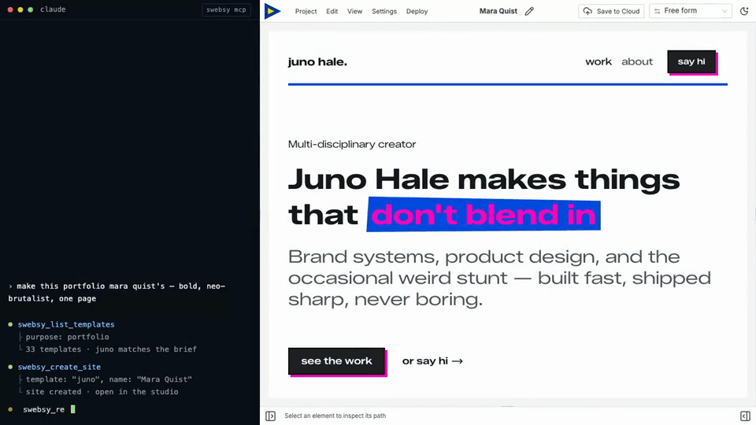

# @swebsy/mcp — connect your coding agent to Swebsy

**Build and edit real websites with the coding agent you already pay for — no per-token AI fees.**

[](https://www.npmjs.com/package/@swebsy/mcp)
[](https://github.com/swebsy/MCP/actions/workflows/ci.yml)
[](LICENSE)



`@swebsy/mcp` is an [MCP](https://modelcontextprotocol.io) server that lets
Claude Code, Codex, Cursor, Windsurf, Cline, GitHub Copilot — or any agent that
speaks the Model Context Protocol — drive an open [Swebsy](https://swebsy.com)
Studio tab. Your agent discovers templates, creates and opens sites, renames projects,
adds sections, edits content, switches pages, captures screenshots, and exports
the finished site, all over a local `127.0.0.1` WebSocket relay. Nothing is proxied through our servers, and Studio redacts
secrets (API keys, deploy tokens, chat history) before anything crosses the
bridge. Your coding agent's own service and privacy policy still apply to the
non-secret content it receives.

## What is Swebsy?

Swebsy is a **visual website builder** with a real ownership model: you build
visually, export real files (HTML/CSS/JS), and publish wherever you want — no
lock-in, no proprietary hosting requirement. The free plan runs fully local;
no account required.

## Why use an MCP instead of a built-in AI panel?

Most "AI website builders" bolt on a chat panel and **bill you per token** on
top of the model you're already subscribed to. Swebsy takes the opposite
approach — it exposes the editor as a tool your **own** agent can drive:

- **No per-token API billing.** Swebsy isn't in the loop on model costs. You use
  the Claude, Cursor, Codex, or Copilot plan you already pay for.
- **Runs on your machine.** The agent talks to your open Studio tab over a local
  `127.0.0.1` bridge — prompts and content aren't shipped off to be metered.
- **Bring your own agent.** Your model, your custom instructions, your workflow
  — not a locked-down wrapper. Any MCP-capable agent works.
- **You own the output.** Everything the agent builds exports as real, portable
  files you can host anywhere.

## Setup

One command registers Swebsy with every supported agent it finds (Claude Code,
Codex, Cursor, Windsurf, VS Code, Cline):

```bash
npx -y @swebsy/mcp setup
```

It never changes an existing `swebsy` entry and never rewrites a config file it
can't parse; it reports each agent's result. Or register it by hand:

**Claude Code**

```bash
claude mcp add swebsy -- npx -y @swebsy/mcp
```

**Codex**

```bash
codex mcp add swebsy -- npx -y @swebsy/mcp
```

**Cursor** — add to `~/.cursor/mcp.json` (or a project's `.cursor/mcp.json`):

```json
{
  "mcpServers": {
    "swebsy": { "command": "npx", "args": ["-y", "@swebsy/mcp"] }
  }
}
```

**GitHub Copilot (VS Code)**

```bash
code --add-mcp '{"name":"swebsy","command":"npx","args":["-y","@swebsy/mcp"]}'
```

**Windsurf** — add the same JSON block to `~/.codeium/windsurf/mcp_config.json`.

**Cline** — add the same JSON block to `cline_mcp_settings.json`, or use the
extension's MCP Servers → Configure button, which opens it:

- macOS `~/Library/Application Support/Code/User/globalStorage/saoudrizwan.claude-dev/settings/cline_mcp_settings.json`
- Linux `~/.config/Code/User/globalStorage/saoudrizwan.claude-dev/settings/cline_mcp_settings.json`
- Windows `%APPDATA%\Code\User\globalStorage\saoudrizwan.claude-dev\settings\cline_mcp_settings.json`

**Cline CLI** (`npm i -g cline`) is a separate install from the extension, with
its own config at `~/.cline/data/settings/cline_mcp_settings.json` and a nested
`transport` block:

```json
{
  "mcpServers": {
    "swebsy": {
      "transport": { "type": "stdio", "command": "npx", "args": ["-y", "@swebsy/mcp"] }
    }
  }
}
```

Or let its own CLI write it: `cline mcp add swebsy --yes -- npx -y @swebsy/mcp`.

## Pairing

Pair once per browser. After that, just ask your agent to build: if no Studio
tab is connected, the first tool call opens Studio and reconnects it by itself
(it waits up to 20 seconds). The session is saved in
`~/.swebsy/agent-<port>.session`, so it survives the bridge restarting.

Claude Code also lists a `/swebsy:swebsy (MCP)` prompt that walks the agent
through connecting and opening a site. Other agents show MCP prompts their own
way, if at all.

To pair by hand:

1. Ask your agent to run the `swebsy_start_pairing` tool. It opens the pairing
   link in your default browser automatically, and also returns the link, raw
   code, and relay port.
2. Swebsy connects automatically and strips the code from the address bar after
   it is used. (Set `SWEBSY_NO_OPEN=1` to skip the auto-open and just get the
   link back.)
3. If the browser didn't open — or Swebsy is running in a different browser —
   open the returned link there yourself, or use the fallback fields in **Global
   settings → Coding agents**: paste the raw code, leave the port at **37373**
   unless you changed `SWEBSY_AGENT_PORT`, and click **Connect**.
4. Prompt your agent as usual — it drives the tab through the `swebsy_*` tools.

Keep the Studio tab open. If the browser puts it to sleep, tools return
`tab_unresponsive` until you click the tab. Pinning it may help, or add Studio
under Chrome's Settings → Performance → "Always keep these sites active".

Full guide: <https://docs.swebsy.com/settings/ai-coding-agent/>

## Multiple agents

Several coding agents can share one paired Studio tab. Register
`@swebsy/mcp` in each agent and use the same `SWEBSY_AGENT_PORT` (default
`37373`) for every server. The first MCP process starts the local broker; later
processes join it automatically, so Studio only needs to be paired once.

Studio shows the connected-agent roster and activity. The broker serializes
commands across agents so the editor handles one command at a time, and routes
each result, screenshot, and export back to the agent that requested it. One
Studio tab can be paired to a broker at a time; pairing another tab revokes the
previous tab.

## What your agent can do

Once paired, your agent can work from Home or Studio. It can refresh and list
installed templates, create the standard blank site or import a template
unchanged, list saved-site metadata, open sites by ID, and rename their internal
Swebsy names. Duplicate names are allowed; IDs are authoritative.

After `swebsy_create_site` or `swebsy_open_site`, poll `swebsy_status` until the
expected `siteId` appears and `editorReady` is `true`. The agent can then read
the page tree, add and edit sections, create and link pages, insert blocks,
manage reusable symbols — including repeating one with different content per
instance while its styling stays in sync — capture screenshots at any viewport,
and export the project.

`swebsy_list_sites` returns metadata only — never page content, thumbnails,
assets, revisions, or settings. Agent-driven create/rename analytics contain
only source/template/site IDs, never internal names or site content.

## Configuration

| Env var             | Default                     | Purpose                          |
| ------------------- | --------------------------- | -------------------------------- |
| `SWEBSY_AGENT_PORT` | `37373`                     | Port the local relay listens on  |
| `SWEBSY_AGENT_DIR`  | workspace `.swebsy-agent`   | Where screenshots/exports land   |
| `SWEBSY_APP_URL`    | `https://studio.swebsy.com` | Studio origin for the `swebsy_start_pairing` link (set for local/self-host) |
| `SWEBSY_NO_OPEN`    | _(unset)_                   | Set to skip auto-opening the pairing link in the browser |

## Build from source

The published package is all you need to use this; the source is here to read,
audit, or hack on.

```bash
git clone https://github.com/swebsy/MCP.git
cd MCP
npm install
npm test
npm run build      # -> dist/server.js
```

Point an agent at your local build instead of npm:

```bash
claude mcp add swebsy -- node /absolute/path/to/MCP/dist/server.js
```

> **This repo is a generated mirror**, snapshotted from the `mcp/` directory of
> Swebsy's main repository on every release. Every file here is overwritten on
> the next sync, so a pull request against it would be erased rather than
> merged — please open an issue instead and we'll apply the change upstream.

## Links

- Website: <https://swebsy.com>
- Setup guide: <https://docs.swebsy.com/settings/ai-coding-agent/>
- npm: <https://www.npmjs.com/package/@swebsy/mcp>
- Source: <https://github.com/swebsy/MCP>

## License

MIT
